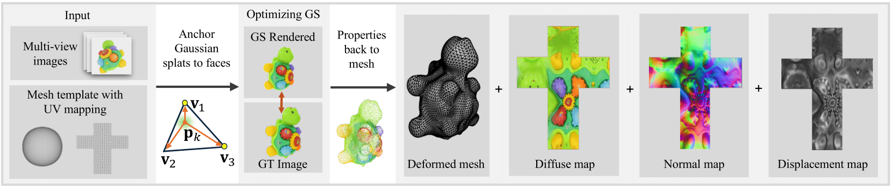

# DeMapGS: Simultaneous Mesh Deformation and Surface Attribute
<a href='https://dl.acm.org/doi/10.1145/3757377.3763860'></a>
<a href='https://shuyizhou495.github.io/DeMapGS-project-page/'></a>
<a href='https://arxiv.org/abs/2512.1057/'></a>
[](https://creativecommons.org/licenses/by-nc/4.0/)

## Introduction

DeMapGS is a structured Gaussian Splatting framework that jointly optimizes deformable surfaces and  surface-attached 2D Gaussian splats.
The unified representation in our method supports extraction of high-fidelity diffuse, normal, and displacement maps.

## Hardware Requirements
- One CUDA-ready GPU. We have tested on RTX4090, L4, A100. 
- Minimal VRAM 24 GB.

## Installation
00. Clone this repo
    ```bash
    git clone --recursive https://github.com/CyberAgentAILab/DeMapGS.git
    ```

### Using Docker
00. Have `docker` and `nvidia-container-toolkit` installed.
01. Build Docker image and set up environment (PyTorch3D installation may take ~30 minutes)
    ```bash
    sudo make setup
    ```

02. Get inside the docker container. Change `DATA_PATH` in [Makefile](Makefile)
    ```bash
    sudo make run
    ```

### Manual Setup
Check [docs/ManualSetup.md](docs/ManualSetup.md)
## Data

1. Download Blender scenes from [link](https://www.cvl.iis.u-tokyo.ac.jp/~zhoushuyi495/dataset/blender_scenes.zip). Unzip them and put them under `rootpath`
    ```bash
    rootpath
        ├── buddha
        │   ├── test/
        │   ├── train/
        │   ├── model.obj
        │   ├── template.obj
        │   └── transforms_train.json
        └── ...
    ```
2. ActorHQ data
    see `include/modified_smplx`
## Example to run

<details>
<summary><strong>Without Docker</strong></summary>

1. Update `rootpath` in [`example_run.sh`](example_run.sh).
2. Run:

    ```bash
    bash example_run.sh
    ```

3. Results appear in `output-blender/buddha`.

</details>

<details>
<summary><strong>Inside Docker</strong></summary>

1. Run:

    ```bash
    xvfb-run -a bash example_run.sh
    ```

2. Results appear in `output-blender/buddha`.

</details>

## License
  Copyright (c) 2025 CyberAgent AI Lab

  This project is licensed under [CC BY-NC 4.0](https://creativecommons.org/licenses/by-nc/4.0/).
  This project builds upon prior work on 3D Gaussian Splatting [3DGS](https://github.com/graphdeco-inria/gaussian-splatting) and 2D Gaussian Splatting [2DGS](https://github.com/hbb1/2d-gaussian-splatting), which are licensed under the Gaussian Splatting License. The original license text is included in the `licenses` directory.

### SMPL-X License Required 
  If using the ActorHQ dataset features, you must obtain a separate
  SMPL-X license from Max Planck Institute at their [website](https://smpl-x.is.tue.mpg.de/)

## Citation
If you find this code useful for your research, please cite our paper:

```
@inproceedings{zhou2025demapgs,
    title={DeMapGS: Simultaneous Mesh Deformation and Surface Attribute Mapping via Gaussian Splatting},
    author={Zhou, Shuyi and Zhong, Shengze and Takayama, Kenshi and Taketomi, Takafumi and Oishi, Takeshi},
    booktitle={ACM SIGGRAPH 2025 conference papers},
    year={2025}
}
```
